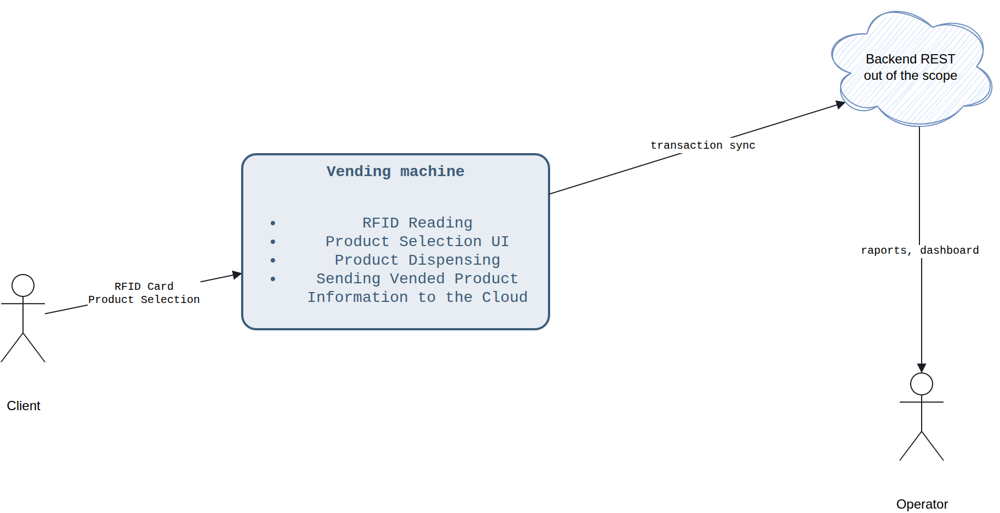
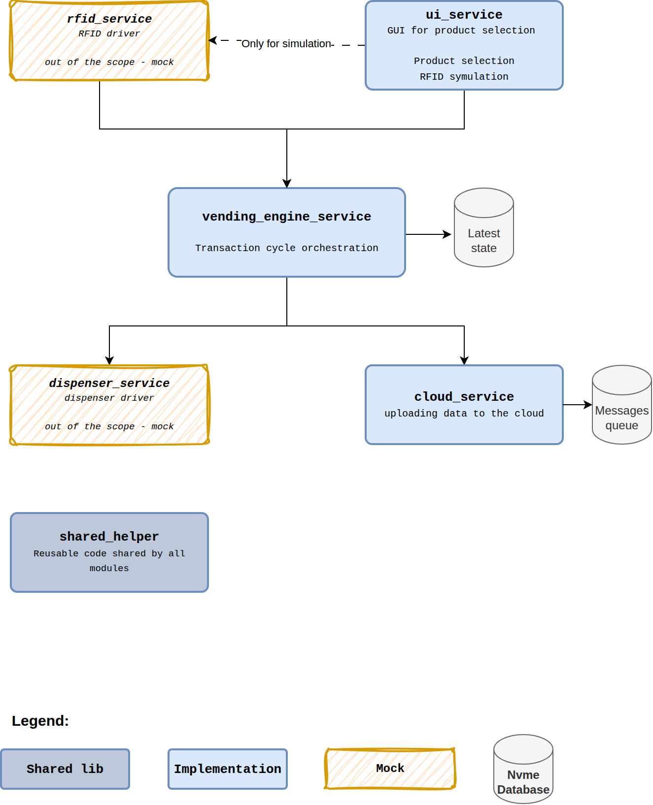

# Vending Machine — Architecture (C4)

> This document describes the architecture using the [C4 model](https://c4model.com/):
> Context (C1) → Container (C2) → Component (C3). Diagrams for C1/C2 are generated
> from [diagrams/c1-context.drawio](diagrams/c1-context.drawio) and
> [diagrams/c2-container.drawio](diagrams/c2-container.drawio) — this document
> only renders and describes what's on those diagrams; it does not add
> anything beyond them. C3 is left as placeholders below, to be filled in
> per component.

## Table of contents

- [C1 — System Context](#c1--system-context)
- [C2 — Container](#c2--container)
- [C3 — Component (per-service description)](#c3--component-per-service-description)
  - [shared_helper](#shared_helper)
  - [cloud_service](#cloud_service)
  - [dispenser_service](#dispenser_service)
  - [rfid_service](#rfid_service)
  - [vending_engine_service](#vending_engine_service)
  - [ui_service](#ui_service)

---

## C1 — System Context

User uses an RFID card to identify themselves, then selects a product on the vending machine's panel.

The machine dispenses the product and sends a notification to the backend service in the cloud.
## C2 — Container

What the vending machine is built from internally.

- **ui_service** — GUI for product selection; also simulates RFID card taps
  (only for simulation, per the diagram) and drives product selection.
- **rfid_service** — RFID driver. Out of scope / mock.
- **dispenser_service** — dispenser driver. Out of scope / mock.
- **vending_engine_service** — transaction cycle orchestration.
- **cloud_service** — uploads vended-transaction data to the cloud.
- **shared_helper** — reusable code shared by all modules.

Legend (from the diagram): solid blue = **Implementation**, orange/sketched
= **Mock**, grey = **Shared lib**.

---

## C3 — Component (per-service description)

_Per-component breakdown — to be filled in._

### shared_helper

_TODO_

### cloud_service

_TODO_

### dispenser_service

_TODO_

### rfid_service

_TODO_

### vending_engine_service

_TODO_

### ui_service

_TODO_
